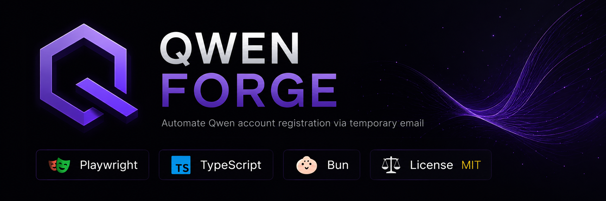

# Qwen Forge

<p align="center">
  
</p>

[](https://opensource.org/licenses/MIT)
[](https://bun.sh/)
[](https://github.com/alay-arch/qwen-forge/releases)
[](https://www.typescriptlang.org/)
[](https://bun.sh)

<p align="center">
  🇺🇸 English • <a href="README.ru.md">🇷🇺 Русский</a>
</p>

**v0.1.3-beta**

Automated Qwen (chat.qwen.ai) account registration via disposable email.

## What is this

Qwen Forge registers accounts on chat.qwen.ai automatically. Creates temporary email, fills the form, confirms registration, saves credentials.

**Why:**
- Need an account for testing
- Bulk registration for a team
- Automation without manual input

## Installation

```bash
curl -fsSL https://raw.githubusercontent.com/alay-arch/qwen-forge/main/install.sh | bash
```

The script checks dependencies (Bun, Git, Chromium), installs to `~/.qwen-forge`, and creates the `qf` command.

After installation:
```bash
source ~/.bashrc
qf --version
```

## Usage

Launch interactive menu:
```bash
qf
```

Select an action:
```
1  Create account
2  Batch create
3  Session
4  Statistics
5  Diagnostics
6  Settings
0  Exit
```

### Examples

**Create one account:**
```bash
qf
# Select "1" → follow prompts
```

**Create 10 accounts:**
```bash
qf
# Select "2" → enter "10"
```

**Check system:**
```bash
qf
# Select "5" → diagnostics shows issues
```

## HTTP API

Server starts automatically on `localhost:3030`.

**Health check:**
```bash
curl http://localhost:3030/api/ping
```

**Create account:**
```bash
curl -X POST http://localhost:3030/api/register
```

**Logout:**
```bash
curl -X POST http://localhost:3030/api/logout
```

## Configuration

Settings in `config.json`:

```json
{
  "version": "0.1.3-beta",
  "server": { "port": 3030 },
  "browser": { "profileDir": ".browser-profile", "timeout": 30000 },
  "mail": { "apiUrl": "https://api.catchmail.io/api/v1", "domain": "catchmail.io" },
  "cli": { "language": "en" }
}
```

**Parameters:**
- `server.port` — HTTP API port
- `browser.timeout` — operation timeout (ms)
- `cli.language` — interface language (`ru` or `en`)

## Common issues

### `Chromium not found`
Install Chromium:
```bash
# Debian/Ubuntu
sudo apt install chromium-browser

# Arch
sudo pacman -S chromium
```

### `Missing shared libraries`
Install dependencies:
```bash
# Debian/Ubuntu
sudo apt install libnss3 libatk-bridge2.0-0 libdrm2 libgbm1

# Arch
sudo pacman -S nss atk at-spi2-atk libdrm mesa
```

### `Registration failed`
- Check internet connection
- Run diagnostics: `qf` → option 5
- Try later (Qwen may have limits)

### `No confirmation email`
- Wait 2-3 minutes
- Check logs: `logs/app.log`
- Run with `--debug` for detailed diagnostics

## Debug

Detailed logs:
```bash
qf --debug
```

Logs saved to `logs/app.log`. Crashes go to `logs/crash-*.log`.

## Requirements

- **Bun** ≥ 1.3
- **Git** — any version
- **Chromium** or **Google Chrome** — system package
- **OS**: Linux (Windows via WSL)

## Documentation

- [Installation](docs/installation.en.md)
- [CLI](docs/cli.en.md)
- [Configuration](docs/configuration.en.md)
- [Troubleshooting](docs/troubleshooting.en.md)
- [Development](docs/development.en.md)

## License

[LICENSE](LICENSE).
